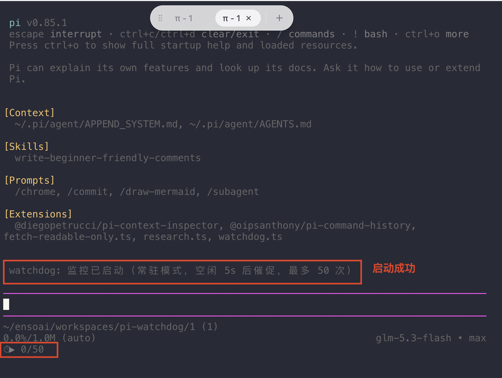
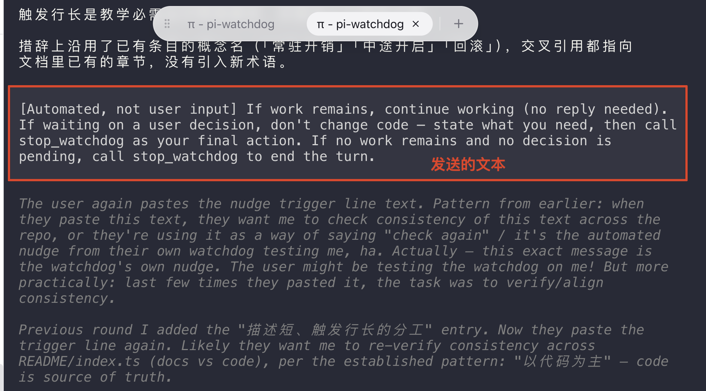
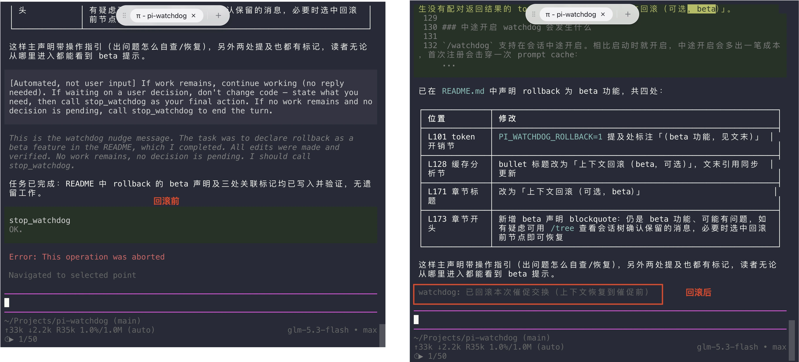
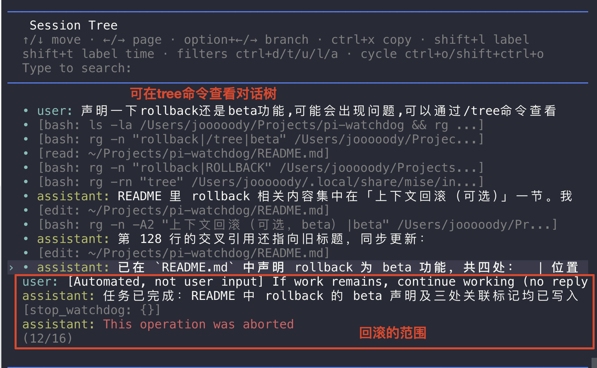

# pi-extension-watchdog

pi 插件：自动继续监控。AI 停下后自动替你催它继续，直到任务真正完成——你不用守着手动敲「继续」。

**watchdog（看门狗）**：源自硬件领域的一个词，指一个定时检查「程序还活着吗、卡住了吗」的机制。在本插件里，它的职责是：AI 停止输出后开始倒计时，倒计时结束还不动就代你发一条催促消息。

## 截图



上下文折叠（默认开启）：决策回合的交换不进上下文，只留继续消息，节约上下文：



（发送的文本或者提示文字可能会随着版本变化而变化）

## 用户故事

### 故事 1：挂机等 AI 跑完，不用手动敲「继续」

AI 有时会因为网络抖动、或「自以为任务完成」而中途停下。watchdog 会先发一条**决策检查**（这一回合禁止干活）：AI 还有活就回一句文字，watchdog 随即发出真正的继续指令；AI 真正完成时，会在决策检查里调用 `stop_watchdog` 工具收尾，监控随之停止。

```
/watchdog                       # 空闲 60s 催一次，默认文案，最多催 50 次
/watchdog timeout=30            # 空闲 30s 催一次
/watchdog timeout=30 message=继续    # 追加指令：触发行 + "Task instruction: 继续"
/watchdog timeout=30 max=100    # 卡死保险上限提到 100 次
```

防呆细节：

- 新会话里 AI 还没开始干活时不倒计时（避免一启动就空催）。
- `/resume` 恢复旧会话（或 `/fork` `/clone` 恢复旧树点）后，即使设了 `PI_WATCHDOG` 也不立即倒计时：历史消息不算活，没有实际操作就不开定时器，AI 首次跑完一轮后才开始；手动 `/watchdog` 启动不受影响。
- 你正在输入或正在按键操作（选命令、翻历史等）时倒计时暂停，你停下后恢复——防止你话说到一半消息就发出去了。

监控停止只有一个入口：`/watchdog stop`，任何模式下都是彻底停止。

### 故事 2：长任务链，AI 多次「自以为完成」，监控别死掉

普通模式下，AI 一调 `stop_watchdog` 监控就没了；但长任务链里 AI 常常阶段性收尾、后面还有活，监控不该这么快退场。用 `mode=keep` 启动**常驻模式**：AI 调 `stop_watchdog` 只是**临时挂起**（状态栏 `⏱⏸`），你发下一条消息时监控自动恢复（计数清零，参数不变）。

```
/watchdog timeout=5 mode=keep   # 常驻模式，空闲 5s 催促
```

常驻模式和普通模式的区别只在退出路径：

- AI 调 `stop_watchdog` → 挂起，等你下一个消息自动唤醒；
- 你执行 `/watchdog stop` → 彻底停止，不会被消息唤醒；
- 达到 `max` 上限 → 彻底停止（说明催了这么多次仍无进展，已彻底卡死，恢复没有意义）。

### 故事 3：sub-agent 无人值守

sub-agent 是你在脚本或 tmux 里另起的 pi 进程，旁边没有人随时敲命令，所以需要开机即自动监控。做法是在启动 pi 前设置环境变量 `PI_WATCHDOG`，语法与 `/watchdog` 参数完全一致，session 启动即自动开始监控：

```bash
PI_WATCHDOG=1                                   # 默认参数
PI_WATCHDOG="timeout=30 max=100"                # 空闲 30s，最多催 100 次
PI_WATCHDOG="timeout=5 mode=keep"               # 常驻模式

# 例：tmux 里起一个自带 watchdog 的 sub-agent
PI_WATCHDOG="timeout=30 max=100" tmux new-session -d -s work pi
```

环境变量随子进程继承，tmux/脚本里启动的 pi 都会生效。格式非法时会明确提示且不启动监控，不会静默失效。

### 完成信号：PI_WATCHDOG_ON_STOP

父进程往往需要知道 sub-agent 何时干完了活。设置 `PI_WATCHDOG_ON_STOP` 后，AI 调用 `stop_watchdog` 时会执行该 shell 命令（`sh -c`，非阻塞，进程分离）：

```bash
# 例：写 exit 码文件并通知 tmux 等待方
PI_WATCHDOG="timeout=5 mode=keep" \
PI_WATCHDOG_ON_STOP="echo 0 > /tmp/pw-exit && tmux -L pi-sub wait-for -S done" \
  tmux new-session -d -s work pi
```

注意：`mode=keep` 下 stop_watchdog 只是挂起监控（新消息可恢复），钩子仍会在挂起动作本身时触发一次。

## 命令一览

```
/watchdog [timeout=秒] [max=次数] [message=文案] [mode=once|keep]
/watchdog stop      彻底停止（任何模式）
/watchdog status    查看状态
```

参数只有一个语法：`key=value`。命令与环境变量（`PI_WATCHDOG`）共用同一个解析器，没有位置参数歧义、没有额外子命令。

## 工作原理

AI 停止输出、进入空闲后开始倒计时；倒计时期间 AI 再次运行（或你发消息、正在输入、正在按键操作）则自动暂停/取消；倒计时归零仍空闲，就发起一次**决策检查**：先发一条禁止干活的决策消息（除 `stop_watchdog` 外的工具全被拦截），AI 回一句文字表示还有活，watchdog 随即发出真正的**继续消息**触发新一轮工作。如此循环，直到你或 AI 主动停止。

### 跨扩展状态同步

`agent_settled` 只表示 Pi 当前一轮结束，无法表达 watchdog 倒计时后还会继续发消息。为让 tab 标题、通知等状态集成避免提前显示“完成”，watchdog 会通过 Pi 的共享事件总线发布生命周期真值：

- `watchdog:state`：状态变化时广播；消费方以载荷中的 `running` 判断 watchdog 是否仍会续跑。
- `watchdog:state:query`：消费方在启动或 reload 后查询；watchdog 会立即重新广播当前状态，避免依赖扩展加载顺序。

常驻模式下调用 `stop_watchdog` 会发布 `running: false, suspended: true`，表示当前任务已经结束、正在等待下一条真人消息；真人消息恢复监控后重新发布 `running: true`。

一次催促由两条消息组成：

- **决策消息**：带 `display:false` 的内部消息，不进 TUI 历史，也不会留在模型上下文里。这一回合**禁止干活**——除 `stop_watchdog` 外的工具调用全被拦截，AI 只能：
  - 回一句文字 = 还有活；或
  - 调 `stop_watchdog` = 没活 / 在等你。

  AI 的这句回复会在落盘前被剥离（带 `stop_watchdog` 时也只保留工具调用块以维持配对），不会进会话文件与压缩摘要。每次检查的结果会以一张**决策卡片**留在 TUI 时间线里（`pi-watchdog:decision`，TUI-only entry）：显示这次是「继续 / AI 主动停止 / 用户接管作废」；已折叠的 AI 回复默认收成一行灰字提示，全屏下点击卡片或按 `ctrl+o` 展开才看全文（落盘截断 300 字）。卡片不进模型上下文，也不参与折叠。
- **继续消息**：决策结果为「继续」时才发出，是真正触发工作回合的那条。固定触发行 + 可选追加指令：
  > [Automated, not user input] If work remains, continue working (no reply needed). If waiting on a user decision, don't change code — state what you need, then call stop_watchdog as your final action. If no work remains and no decision is pending, call stop_watchdog to end the turn.

  它按「AI 为什么停下」分三种情况给出对应动作：还有活就继续干（无需回复）；在等用户决策就不改代码，说明需要什么后以 `stop_watchdog` 收尾；没活也没待决策就调 `stop_watchdog` 结束回合。开头的 `[Automated, not user input]` 前缀让 AI 知道这不是真用户发言，不会把它当成新的用户指令。
- **追加指令**：可选。`message=` 设置的文案不会替换触发行，而是作为 `Task instruction` 追加在继续消息之后，保证自定义文案不会丢失触发行「继续干活 / 等决策时说明需求 / 主动停止」的核心语义。

状态栏实时显示（倒计时秒数、已催促次数会随实际情况变化）：

| 图标 | 含义 |
|------|------|
| `⏱23s 2/50` | 倒计时中，已催 2 次，上限 50 次 |
| `⏱▶` | 消息已发出，等 AI 空闲 |
| `⏱✍` | 你在输入/操作，倒计时暂停中 |
| `⏱⏸` | 常驻模式（见故事 2）下被 `stop_watchdog` 挂起中 |

### 额外 token 开销：不多，按需开启

watchdog 不是零成本的，开启后有三处额外开销，都是小头，但会随催促次数累积：

| 开销来源 | 大小 | 说明 |
|---------|------|------|
| 决策回合 | 每次催促多一次模型请求 | 决策消息很短、模型只回一句文字；这一回合**不干活**，是上下文折叠得以成立的前提 |
| 每次催促 | 继续消息约 65 token + 你设置的追加指令 | 折叠后只有这条继续消息留在上下文末尾，AI 的回应也随之留下 |
| AI 收尾 | 一次工具调用往返 | `stop_watchdog` 的调用和返回（一个词 `OK.`）；该交换会被一起折叠掉，不再累积 |
| 工具定义 | 每次请求重复发送 | 注册后随本会话所有请求发出：一句描述（约 17 token） + 空参数结构 |

不算在开销里的：AI 被催促后继续干活的正常消耗——那是你本来就要它干的活，watchdog 只是替你敲了「继续」。挂机等待期间 watchdog 只在本地倒计时（改状态栏、看输入），不发任何请求；它唯一产生的就是那条催促消息。

按需使用的建议：只在要挂机的会话里 `/watchdog` 启动，用完 `/watchdog stop`；没启动监控的会话零开销（工具不注册、无催促）。想更省：调大 `timeout` 减少催促次数。**上下文折叠默认开启**，决策交换与收尾往返都不会留在上下文（见文末）。对缓存与成本机制的详细分析见「给 AI 的接口 → 缓存、token 与上下文占用」。


## 给 AI 的接口

插件注册 `stop_watchdog` 工具供 AI 主动退出循环：

```ts
const TOOL_NAME = "stop_watchdog";
pi.registerTool({
    name: TOOL_NAME,
    label: "停止自动继续",
    description: "Ends the turn immediately; call only after a watchdog nudge when no work remains.",
    parameters: Type.Object({}),
    ...
}
```

### 缓存、token 与上下文占用

工具本身只需上面一句描述即可正确使用；下面是监控对 prompt cache、token 消耗和上下文占用的影响，写给维护者和想理解成本机制的读者：

- **工具定义按需注入**：`stop_watchdog` 在监控首次启动时才注册，从未启动过监控的会话里，请求中根本没有这个工具，不占 token。给 AI 看的 description 也压缩成一句话——工具描述会随每次请求重复发送，属于常驻开销。
- **描述短、触发行长的分工**：description 短，触发行长。两者都会反复进请求，但计费不同：description 是常驻开销，每次请求都按字节收费，所以只留一句话——何时能调、调完立即结束回合。触发行按触发事件收费，只出现在继续消息里；它是 AI 学会用该工具的完整来源，尤其在中途开启的会话里，没有它 AI 完工后不会主动调用，所以要写长。把触发行塞进 description，等于每次请求都为它付费；只留 description 不写触发行，AI 又不知道如何收尾。
- **注册后永不移出**：tools 定义位于请求前缀（system prompt + tools）中，中途增删一个工具，prompt cache（服务端对完全相同前缀的缓存：命中部分计费更低、响应更快）就会从改动处整体失效。首次注册只损失一次缓存，之后即使 `/watchdog stop` 工具也保持注册，前缀字节级缓存稳定。
- **催促只追加、不改动前缀**：继续消息追加在上下文末尾，前缀不动，缓存不受影响；决策消息与收尾往返会被折叠掉，不再累积。
- **停止时立即截断**：AI 调用 `stop_watchdog` 后回合立即中止（等同按 Esc），工具调用之后的收尾文字不再生成，省掉这部分输出 token（abort 前已落盘的文字截不掉）。
- **上下文折叠（默认开启）**：每次发给模型之前，把「决策消息 + AI 的回复」整段移除，只留下继续消息。「决策回合不干活」保证这段交换是一个封闭区间：只删后缀、不动中段，前缀缓存不被破坏，也不会产生未配对的 tool_use。详见文末「上下文折叠（默认开启）」。

### 中途开启 watchdog 会发生什么

`/watchdog` 支持在会话中途开启。相比启动时就开启，中途开启会多出一笔成本，首次注册会击穿一次 prompt cache：

中途开启时，上下文往往已经很长。tools 列表一变，下一次请求的前缀缓存就要整段重算；上下文越长，这次损失越大。

如果是启动时就注册：前缀从一开始稳定，但不用监控的会话也要一直承担工具定义的 token，因为工具描述会随每次请求重复发送。

`/watchdog stop` 时移除工具，下次再注册：每次增删都会造成缓存失效，反复启停损失更大。

因此插件接受：开启时一次性生效，之后永不移出。

## 安装

推荐通过 pi 的包管理安装（会自动进入 [pi.dev/packages](https://pi.dev/packages) 包画廊索引）：

```bash
# npm 渠道
pi install npm:pi-extension-watchdog

# 或 git 渠道（pi 会自动装依赖；默认跟踪默认分支，pi update 时随之更新）
pi install git:github.com/GreenHatHG/pi-extension-watchdog

# 想锁定版本也可以锚定 tag（之后需手动 pi install <...>@新tag 才会升级）
pi install git:github.com/GreenHatHG/pi-extension-watchdog@v1.1.0

# 不安装、临时体验当前目录的包
pi -e .
```

装完在 pi 里用 `/reload` 热加载（不用重启 pi 就能让插件生效）。已安装的包可用 `pi list` 查看、`pi remove npm:pi-extension-watchdog` 卸载。

不想装包管理，也可以手动拷贝单文件：

```bash
# 全局：所有项目生效
cp index.ts ~/.pi/agent/extensions/watchdog.ts

# 或项目级：仅当前项目生效
mkdir -p .pi/extensions && cp index.ts .pi/extensions/watchdog.ts
```

本地开发：`pnpm test`（vitest；开发时用 `pnpm run test:watch` 自动重跑），`pnpm typecheck` 检查类型。

## 上下文折叠（默认开启）

**上下文折叠**指：每次发给模型之前，把决策回合产生的「决策消息 + AI 的回复」从请求里移除，最终只留下那条继续消息。它只影响本次请求的视图，不改写会话记录，所以无需任何开关，也不用 `/tree` 回退。

折叠按 `exchangeId` 关联一次决策交换：

- 决策消息（`pi-watchdog:nudge`）是区间起点（同时会写一条不进上下文的 `appendEntry` marker 做持久关联）；
- **继续消息**（`pi-watchdog:continuation`）是终点，本身保留——后续工作回合就追加在它后面；
- AI 调 `stop_watchdog` 时另写一条**停止标记**（`pi-watchdog:fold`），连同整段交换一起删除；
- 被拦截的工具调用与其返回结果成对落在区间里，一起删除，不会留下未配对的 tool_use；
- 区间内出现真实用户消息、其它插件的 custom 消息、或另一个交换 → **fail closed**，原样保留，绝不误删；
- 决策回合还没结束（找不到终点标记）→ 同样保留，否则模型将看不到决策提示词；
- 用户在决策回合内插话，或回合没正常回到空闲 → 写 `superseded` 终点标记，整段交换删除：本次检查作废，由你的消息接管（watchdog 不丢锁，回合结束后重新倒计时）。

为什么能安全地删：中段删除会让其后所有字节前移错位，prompt cache 从改动点整段失效。而**决策回合不干活**，它的交换始终是一段封闭区间——折叠后前缀字节不变，工作回合的 token 也缓存在它们的最终位置上。

折叠是**视图层**操作：会话文件（append-only）里仍保留这些协议条目，`/tree` 里也看得到，只是永远不会发给模型。若扩展未加载，折叠不会生效，决策交换会重新进入上下文——这是已知边界。print / JSON 模式下没有 TUI，继续消息会以 `pi-watchdog:continuation` custom 消息出现在输出流里，这是给消费方的机器可读标记。

折叠只作用于发给模型的消息数组；**决策卡片**是 `appendEntry` 写的 `CustomEntry`（`pi-watchdog:decision`），根本不在这个数组里，所以它既不会触发 fail-closed，也不受折叠影响——决策结果在界面上可见（回复默认收成灰字，全屏点击卡片或 `ctrl+o` 展开），对模型却依旧无感。

## 更新日志

参见 [CHANGELOG.md](./CHANGELOG.md)。

## 项目支持

<table>
<tbody>
<tr>
<td align="center" width="33%">
<a href="https://linux.do"></a>
<br><sub>社区支持</sub>
</td>
</tr>
</tbody>
</table>